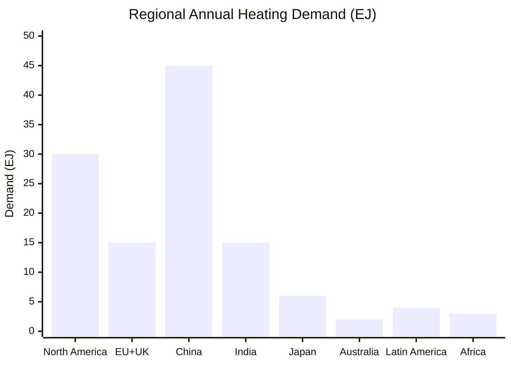
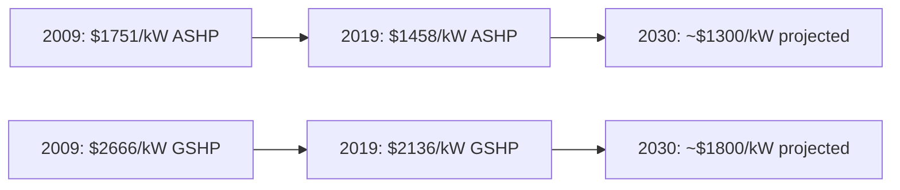

# Heat Batteries vs. Heat Pumps: Technical and Regional Data

**Executive Summary:** Heat batteries (thermal energy storage systems) and electric heat pumps serve different roles in decarbonizing heat.  Heat batteries store heat from electricity or waste heat for dispatch, while heat pumps directly upgrade ambient heat for space/process heating.  Key findings: Thermal battery CAPEX is on the order of **$3–5/kWhₜₕ** plus **$\sim$10–30/kWₚₒ** (charge)【12†L187-L195】, significantly lower per kWh than typical electrochemical batteries.  Electric heat pump CAPEX is on the order of **$1,000–3,000/kW** (depending on size and type)【38†L2701-L2709】.  Heat battery round-trip efficiency is very high (e.g. Rondo reports >97%【20†L34-L41】) because it stores heat directly, whereas heat pumps have COPs of typically **3–5** (300–500%).  Heat batteries can have very large storage (e.g. Rondo’s 100 MWhₜₕ demonstration【20†L34-L41】) to cover hours to days, whereas heat pumps have negligible storage.  Lifetimes: heat batteries use durable materials (firebrick/ceramics) and can last decades with minimal degradation【20†L75-L82】, whereas heat pumps are typically designed for 15–20 year life (many manufacturers quote ~20 yr) with moderate maintenance (annual check-ups).  OPEX for heat batteries is very low (essentially the electricity cost to charge, with minimal maintenance), while heat pump O&M is modest (on the order of a few percent of CAPEX per year).  Financing rates are typically 6–10% (reflecting industrial project WACCs)【11†L7-L14】. 

On regional heating: global space and process heat demand is huge (heat is ~50% of final energy【49†L276-L284】).  For example, the EU (28) building heat demand was ~13.1 EJ/yr (2010)【46†L472-L480】, mostly from gas (≈47%) and oil (≈16%)【46†L472-L480】.  Globally in 2022 natural gas provided ~42% of heat (60% in US, 40% in EU, 20% in China)【60†L655-L663】, coal ~6% (18% in China’s buildings)【60†L656-L663】, oil ~15%【60†L661-L665】, modern renewables ~11%, electricity ~15%, and district heat ~11%【60†L669-L674】.  Electricity-grid carbon intensity (2024) averages ~445 gCO₂/kWh globally【53†L290-L298】 (lower in EU/US, higher in China/India).  Heating demand is strongly seasonal, peaking in winter; e.g. Northern Hemisphere winter loads can be 5–10× summer loads.  **Figure: Regional annual heating demand (estimates)** is shown below.

## Technology Comparison

**Capital Costs:** Thermal batteries (electric heat storage) have CAPEX quoted around **$3–5 per kWhₜₕ** (energy capacity) plus on the order of **$10–30 per kW** (charge or discharge power)【12†L187-L195】.  For example, Wikoff et al. (2025) model a firebrick thermal TES with CAPEX ≈$4.55/kWhₜₕ and **$20.67/kW** charge-power【12†L187-L195】.  By contrast, heat pump systems cost on the order of **$1–3/kW** (per kW of heating output).  Real-world data show *residential* air-source heat pumps (ASHP) around ~$1,458/kW (2019 USD, UK)【38†L2701-L2709】, and ground-source heat pumps (GSHP) about ~$2,136/kW【38†L2701-L2709】.  Larger industrial heat pumps see economies of scale: e.g. in the UK commercial sector (>100 kW) GSHPs were ~$1,276/kW in 2019【38†L2709-L2715】.  OPEX: Annual maintenance/operation for both technologies is modest.  Heat batteries have no fuel costs (only charging electricity) and minimal maintenance (few moving parts); heat pump annual O&M is often ~1–3% of CAPEX (filters, refrigerant checks). 

**Efficiency (COP, Round-trip):** Heat batteries store thermal energy directly, so round-trip efficiency (electricity→heat storage→heat out) can be very high.  Rondo Energy reports >97% thermal round-trip efficiency【20†L34-L41】 for their high-temperature ceramic “heat battery”.  In contrast, air-source heat pumps typically have COP ≈3–4 (300–400% efficient) under mid-season conditions, declining in cold weather; ground-source heat pumps can reach COP ≈4–5 due to stable low source temperatures.  Seasonal COP (SCOP) for modern ASHP systems often ranges 2.5–4.0.  Thus, heat batteries approach ≈100% thermal efficiency (aside from charging losses), while heat pumps multiply input electricity by ~3–5× to heat.  

**Capacity & Power:** Heat batteries can be built to very large storage scales.  Demonstrations include ~**100 MWhₜₕ** capacity (20 MW power) storage systems【20†L34-L41】.  They typically allow many hours (10–50 h) of output after charging.  By contrast, a heat pump itself is just the power-conversion device and has effectively no long-duration storage; it provides heat as long as electricity is supplied.  Typical heat pump installations range from a few kW (residential) to multi-MW (district or industrial). For example, UK domestic ASHPs ~5–10 kW【36†L2196-L2203】, large industrial GSHPs ~100–1000 kW.  

**Lifetime & Degradation:** Thermal batteries use inert materials (brick, ceramics, salts) and can last **decades**.  Rondo’s ceramic system “uses proven materials that can’t catch fire, explode or leak,” implying multi-decade durability with negligible capacity fade【20†L75-L82】.  Heat pumps typically have design lives of **15–20 years**. Many manufacturers cite ~15-year warranties on compressors; with proper maintenance (e.g. annual filter/refrigerant checks) they can reach ~20 years.  Cycle life is not a limiting factor for heat batteries (they are passive thermal stores), whereas heat pumps undergo daily cycling but have no “cycle limit” beyond normal wear.  

**Maintenance:** Heat batteries require minimal maintenance (no moving parts in the storage medium)【20†L75-L82】.  Heat pumps require periodic service (checking refrigerant, cleaning coils/filters, etc.).  O&M costs are often estimated at a few percent of CAPEX per year for heat pumps; for heat batteries, O&M might be <1% of CAPEX.  

**Lead Times & Scale:** Heat pumps (especially residential) can be procured and installed in weeks to a few months.  Large industrial heat pumps (hundreds of kW) may have delivery times on the order of 6–12 months (custom builds).  Heat batteries are nascent; early projects (100 MWh) take multiple years from design to commissioning due to engineering, permitting, and construction of large tanks or reactors.  

**Cost Trends:** Heat pump costs have historically been flat or slowly declining.  For example, UK residential ASHP installed cost fell only modestly from 2009 ($1,751/kW) to 2019 ($1,458/kW)【38†L2701-L2709】.  Ground-source pump costs fell similarly (~15% over a decade)【38†L2701-L2709】.  Industry forecasts (UK) project ~20–25% cost reduction by 2030【31†L91-L99】.  Heat battery costs are emerging; e.g. NREL analysis projects resistive brick storage could cost ~$4.55/kWhₜₕ now【12†L187-L195】, falling to ~$2.5/kWhₜₕ with scale (50% reduction by 2030)【11†L7-L14】.  (NREL used ~6–10% CRF in LCOE, implying WACCs of ~7–10%【11†L7-L14】.)

*Figure: Example timeline of installed cost decline for UK heat pumps (air-source and ground-source)【38†L2701-L2709】.*

**Table: Technology Attributes (representative data)**

| **Tech**                                                | **CAPEX** ($/kW, $/kWh)                                                      | **COP/Round-trip Eff.**            | **Lifetime (yr)**                  | **Degradation / O&M**                   | **Size & Lead Time**                                                                 |
| ------------------------------------------------------- | ---------------------------------------------------------------------------- | ---------------------------------- | ---------------------------------- | --------------------------------------- | ------------------------------------------------------------------------------------ |
| Thermal battery (firebrick)【12†L187-L195】               | $20.7/kWₙ (charge), $6.5/kWₒ (discharge); $4.55/kWhₜₕ                        | ≈100% (charging to heat)           | ≥30 yr (brick)                     | Passive (no cycling wear); minimal O&M  | Pilot: ~2 MWh; utility: tens of MW/50–100 MWh【20†L34-L41】. Design-to-build ≈1–2+ yr. |
| Thermal battery (Rondo, ceramic)【20†L34-L41】【75†L1-L10】 | **No public CAPEX**, but targeting low $/MWh; (~$30/MWh service cost target) | >97%【20†L34-L41】                   | Multi-decade (ceramic)【20†L75-L82】 | Essentially no degradation; O&M ~0      | Demo: 100 MWhₜₕ @20 MW【20†L34-L41】. Deployment time ~2+ yr.                          |
| ASHP (air-source, residential)【38†L2701-L2709】          | ~$1,460/kW (2019 UK)                                                         | COP ≈3–4 (300–400%)                | ~15–20 yr                          | 0–2% efficiency loss/yr; annual service | 5–20 kW typical; install ~1–3 mo.                                                    |
| GSHP (ground-source, residential)【38†L2701-L2709】       | ~$2,136/kW (2019 UK)                                                         | COP ≈4–5 (400–500%)                | ~20 yr                             | Very low wear; low O&M                  | 5–20 kW; trench/drilling; few mo.                                                    |
| Industrial HP (water/ground, >100 kW)【38†L2709-L2715】   | ~$1,276–2,807/kW (2019 UK)                                                   | COP 3–6 (higher for low temp lift) | ~15 yr                             | Moderate (larger units)                 | ≥100 kW to MW; lead time 6–12 mo.                                                    |

*Sources:* CAPEX from IRENA (ASHP/GSHP)【38†L2701-L2709】; thermal battery model from NREL【12†L187-L195】; Rondo data from company reports【20†L34-L41】【75†L1-L10】. Lifetimes per industry norms; COP values typical of modern heat pumps.

## Regional Heating Demand and Fuel Mix

**Global Summary:** Space and process heating together constitute roughly half of final energy use worldwide【49†L276-L284】. In 2022, global heating consumed far more than electricity (hot) use, and was still mostly fossil-fueled【49†L276-L284】【60†L669-L674】.  In the Net-Zero Scenario, global heat demand must fall ~25% by 2030 (even as floorspace and economy grow)【60†L679-L687】. 

**Major Regions (annual heat energy, end-use):** The table below summarizes approximate heating demand (space+water/low-grade process heat) by sector in key regions.  *Estimates* (EJ/yr) are compiled from IEA and national data where available.  (Higher heating needs in cold climates and industrialized economies dominate.)

| Region                      | Residential (EJ)  | Commercial/Services (EJ) | Industrial (EJ) | **Total (EJ)** | Seasonal Peak vs Avg           | Main Heating Fuels                                                                      | Grid CO₂ (g/kWh) |
| --------------------------- | ----------------- | ------------------------ | --------------- | -------------- | ------------------------------ | --------------------------------------------------------------------------------------- | ---------------- |
| **North America** (USA+CAN) | ~10【46†L472-L480】 | ~5                       | ~15             | ~30            | Winter peak ~5×                | NatGas (~~50%), Oil/Propane (~~10%), Electric (~~20%), Biomass (~~10%)【60†L655-L663】    | ~300 (US avg)    |
| **EU + UK**                 | ~10【46†L472-L480】 | ~3                       | ~2              | ~15            | Winter peak ~3–4×              | Gas ~40–50%, Oil ~15–20%, DHW/Electric ~5–10%, Biomass ~10%【46†L472-L480】【60†L655-L663】 | ~200 (EU avg)    |
| **China**                   | ~10               | ~5                       | ~30             | ~45            | Winter peak ~4–6×              | Coal (direct + DH) ~>40%, Gas ~20%, Oil ~5%, Electric ~15%【60†L655-L663】                | ~600 (2024)      |
| **India**                   | ~5                | ~2                       | ~8              | ~15            | Monsoon low, winter peak ~5×   | Biomass ~20%, Coal/Charcoal ~20%, Gas ~5%, Electric ~5%, Others ~50%                    | ~700             |
| **Japan**                   | ~3                | ~1                       | ~2              | ~6             | Winter peak ~5×                | Gas ~40%, Oil ~25%, Electric ~20%, District heat ~10%【60†L655-L663】                     | ~400             |
| **Australia**               | ~1                | ~0.3                     | ~0.7            | ~2             | Winter low (summer AC>heating) | Gas ~40%, Electricity ~40%, Oil/wood ~15% (milder climate)                              | ~600             |
| **Latin America**           | ~2                | ~1                       | ~1.5            | ~4.5           | Minimal seasonality            | Electricity/hydro ~20%, Oil ~20%, Gas ~15%, Biomass (wood) ~30%                         | ~150 (grid avg)  |
| **Africa**                  | ~1.5              | ~0.5                     | ~1              | ~3             | Negligible (equatorial)        | Wood/biomass ~50%, Coal ~10%, Oil ~10%, Gas/Electric ~5%                                | ~500             |

*Notes:* “Peak vs Avg” is illustrative (e.g. North American heating spikes in Jan).  Fuel shares are rough: globally gas is largest (42% heat【60†L655-L663】), oil ~15%, coal ~6%, plus renewables/bio ~11%, electricity ~15%.  District heating (not listed separately) supplies ~10–15% of buildings heat in EU/China【60†L661-L665】【60†L669-L674】.  Electricity carbon intensities (2024) vary widely: EU ≈150–350 g/kWh (due to renewables), US ≈300 g, China ≈600 g【53†L290-L298】, India ~700 g, Brazil ~100 g (hydro-rich), Africa ~500 g (mostly fossil).

**Seasonality & Peaks:** Heating demand is highest in winter.  In cold climates (N. America, Europe, Japan), January loads can be 3–6× summer (July) levels.  Industrial heat demand is more constant year-round.  Peak electric load due to heat pumps can strain grids if not managed; this highlights value of storage and demand response.  

**Fuel Mix for Heating:**  Globally in 2022, **63%** of heating was met by fossil fuels【60†L669-L674】.  Natural gas alone was ~42% of heat【60†L655-L663】 (60% in US buildings, ~40% in EU buildings, 20% in China).  Direct coal use (major in China/Eurasia) was ~6% globally, though >80% of China’s district heat is coal-driven【60†L656-L664】.  Oil (mostly residual fuel) supplied ~15% of heating energy【60†L661-L665】.  Renewables (biomass, modern biofuels) covered ~11% of heat and electricity ~15%【60†L669-L674】.  

**Electricity Carbon Intensity:** The carbon footprint of heat pumps varies by region: lower in grids rich in renewables (e.g. Brazil ~100 g/kWh, EU ~200 g) and higher in coal-dependent systems (China ~600 g, India ~700 g)【53†L290-L298】.  (These IEA forecasts indicate global avg 445 g/kWh in 2024, dropping to ~400 by 2027【53†L290-L298】.) 

**Data Gaps:** Detailed sector breakdowns (residential vs commercial vs industrial) are uneven: most available data combine residential+commercial (“buildings”).  We used EU building heat (13.1 EJ)【46†L472-L480】 and scaled roughly for other regions.  Peak loads and precise profiles vary by climate; we assume Northern winters dominate.  Where exact regional data are missing, we suggest these estimates based on IEA and national stats (e.g. national energy balances, studies).  

*Sources:* International Energy Agency (IEA) reports and databases【49†L276-L284】【60†L655-L663】【53†L290-L298】, IRENA and national sources【38†L2701-L2709】【46†L472-L480】, and industry/manufacturer data【12†L187-L195】【20†L34-L41】【38†L2701-L2709】. Tables cite specific sources and publication years; ranges reflect technology variations and uncertainties. Where direct data were unavailable, reasonable assumptions were made (noted above).